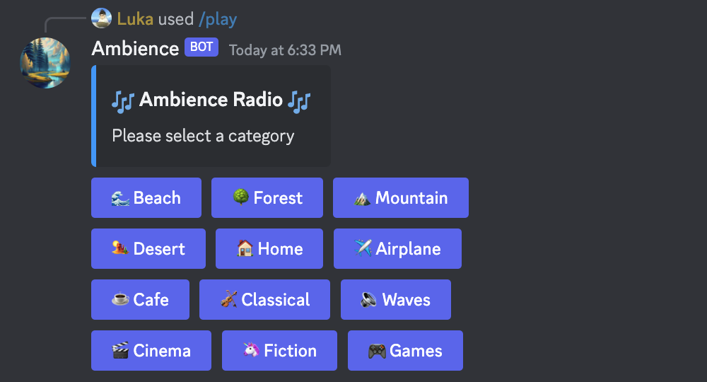

<p align="center">
  <a href="https://github.com/othneildrew/Best-README-Template">
    
  </a>

  <h1 align="center">Ambience</h3>

  <p align="center">
    A Discord Bot that provides quality music for work, productivity, and flow. Invite it on Discord to improve your focus!
    <br />
    <br />
   <a href="https://discord.com/api/oauth2/authorize?client_id=1139308853838762135&permissions=2150975488&scope=bot%20applications.commands" style="font-size: 25px;"><strong>Invite the Bot »</strong></a>
    <br />
    <br />
     <a href="https://lnadi17.github.io/Ambience/">View Website</a>
    ·
    <a href="https://discord.com/invite/w3Tp9x88Nw">Join the Community</a>
    ·
    <a href="https://forms.gle/oNr6sBoLndMGfx4M9">Recommend a Song</a>
    ·
    <a href="https://github.com/lnadi17/Ambience/issues">Request a Feature</a>
  </p>
</p>

## About The Project
Ambience is a Discord bot designated to help you focus and work with the use of calming and soothing background noise. Choose over 15 categories of sounds designed to help you concentrate and get work done.



Ambience Features:
* Listen and focus to peaceful tunes
* 10+ categories and 50+ handpicked songs to choose from
* Open source and community-driven

In the future, Ambience plans to improve audio quality, add more sound categories, and add more features depending on our customer's needs. If you would like to recommend a feature, please visit [this link](https://github.com/angelina-tsuboi/Ambience/issues).

## Built With

The Ambience bot was made using the following technologies:
- TypeScript
- Node.js
- discord.js
- discordjs/voice

### Installation

This is an example of how you may give instructions on setting up your project locally.
To get a local copy up and running follow these simple example steps.

1. Clone the repo
```sh
git clone https://github.com/angelina-tsuboi/Ambience.git
```
2. Install NPM packages
```sh
npm install
```
3. Run the Server
```sh
node index.ts
```

## Usage

Please visit the [Documentation page](https://angelina-tsuboi.github.io/Ambience/website/docs.html) on the Ambience site to view all the commands for the bot. 
If you encounter any difficulties, please join our [Discord server](https://discord.com/invite/w3Tp9x88Nw) to receive the help you need.

## Contributing

Contributions are what make the open source community such an amazing place to be learn, inspire, and create. Any contributions you make are **greatly appreciated**.

1. Fork the Project
2. Create your Feature Branch (`git checkout -b feature/AmazingFeature`)
3. Commit your Changes (`git commit -m 'Add some AmazingFeature'`)
4. Push to the Branch (`git push origin feature/AmazingFeature`)
5. Open pull Request

## License

Distributed under the GPL-3.0 License. See [LICENSE](LICENSE) for more information.
